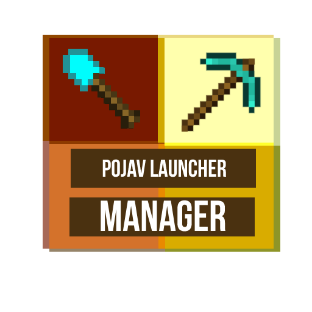

# Pojav Launcher Manager

<!-- PROJECT LOGO -->
 

  

  <h3 align="center">Pojav Launcher Manager 
  An app that gives you the latest releases of PojavLauncher (Minecraft Java for Android and iOs)</h3>

  

     
    <a href="https://play.google.com/store/apps/details?id=com.pablogod.PojavLauncherManager">Play Store</a>
    ·
    <a href="#">Report Bug</a>
    ·
    <a href="#">Request Feature </a>
  

### External resources to dev

- Docker development: https://medium.com/@cezary.zelisko/how-to-prepare-a-flutter-workspace-in-a-docker-container-e56e0c7c7dcd
- Repo of docker https://github.com/DZGames/flutter_dev
